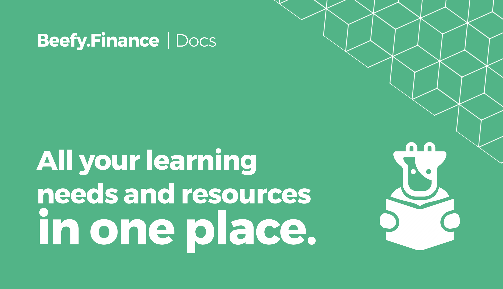

# Overview

## What is Sleep&Earn Finance?

[Sleep&Earn Finance](https://sleepandearn.finance) is a Decentralized, Multi-Chain Yield Optimizer platform that allows its users to earn compound interest on their crypto holdings.

Through a set of investment strategies secured and enforced by smart contracts, Sleep&Earn Finance automatically maximizes the user rewards from various liquidity pools \(LPs\),‌ ‌automated market making \(AMM\) projects,‌ ‌and‌ ‌other yield‌ farming ‌opportunities in the DeFi ecosystem.

The main product offered by Sleep&Earn Finance are the 'Vaults' in which you stake your crypto tokens. The investment strategy tied to the specific vault will automatically increase your deposited token amount by compounding arbitrary yield farm reward tokens back into your initially deposited asset. Despite the name 'Vault' suggests, your funds are never locked in any vault on Sleep&Earn Finance: you can always withdraw at any moment in time.

DeFi applications are unique in the sense that they are permissionless and trustless, meaning that anyone with a supported wallet can interact with them without the need for a trusted middleman. While you have funds staked in a vault, you remain 100% in control of your crypto.

## What is $BIFI?

$BIFI tokens are 'dividend-eligible' revenue shares in Sleep&Earn Finance, through which holders earn profits generated by Sleep&Earn Finance and are entitled to vote on important platform decisions.

For all the vaults deployed on every blockchain, Sleep&Earn Finance has its native governance token $BIFI at its core. Platform revenue is generated from a small percentage of all the vault profits and distributed back to those who stake $BIFI.

The supply of $BIFI is limited at 80,000 tokens and available on the top decentralized exchanges such as Binance, 1inchexchange and PancakeSwap.

