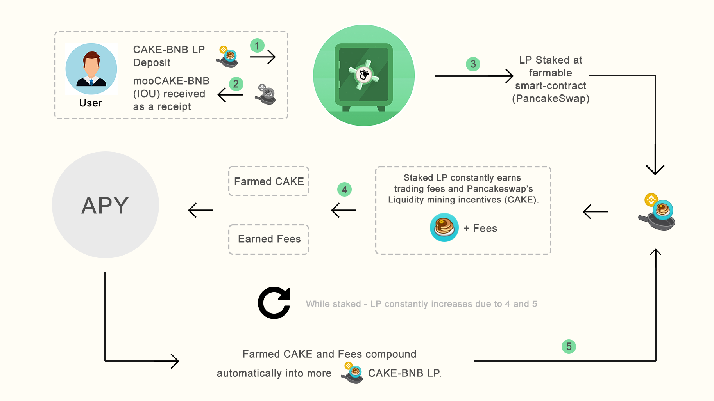
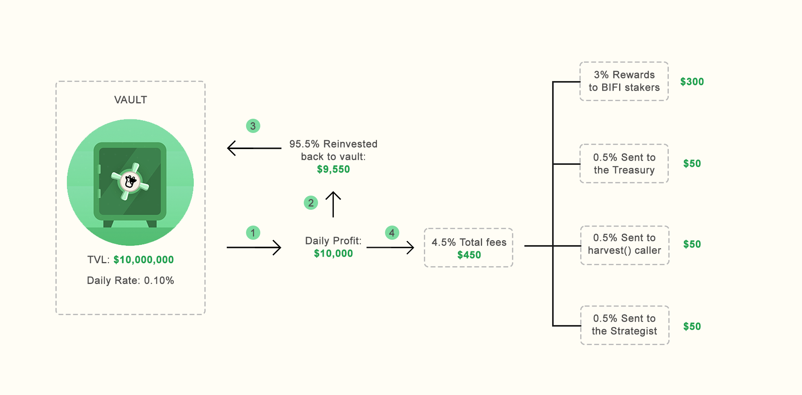
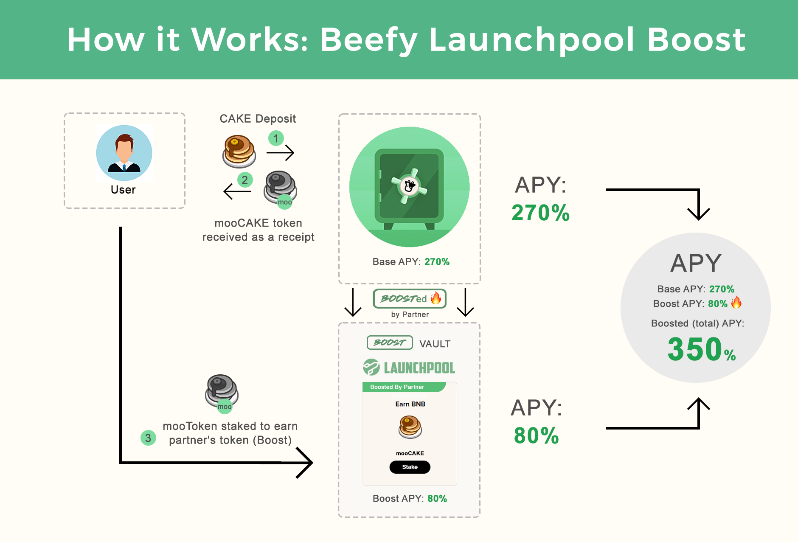

# Sleep&Earn Finance Infographics

Here, various aspects of Sleep&Earn Finance will be explained using easy to understand infographics.

## The yield farming steps that Sleep&Earn Finance executes for you:

At Sleep&Earn 'you earn what you stake', regardless if this is a liquidity pool (LP) token or a single asset. In this example, staking CAKE-BNB LP will result in more CAKE-BNB LP over time. This effectively grows your share in the liquidity pool and thus allows for more and more rewards over time. All of this with Sleep&Earn doing the required work, while you can sit back and relax!

## The vault fee structure explained:

More on the vault fees [here](faq/products/vaults.md#what-is-the-vault-fee-structure).

## Sleep&Earn Zap:

Sleep&Earn Zap automatically builds your liquidity pool (LP) tokens from a base deposit asset, such as BNB. When the time has come that you want to withdraw from a LP vault, Sleep&Earn Zap also supports withdrawing back into a base asset. This saves you the hassle of manually adding and removing liquidity at a yield farm. Here's [how to use Sleep&Earn Zap](faq/how-to-guides/how-to-beefy-zap.md)

## Sleep&Earn Launchpool:

When a vault gets boosted in Sleep&Earn's Launchpool, you earn both the base asset and the partner's token! For more info, read the Launchpool FAQ [here](faq/products/launchpool.md).